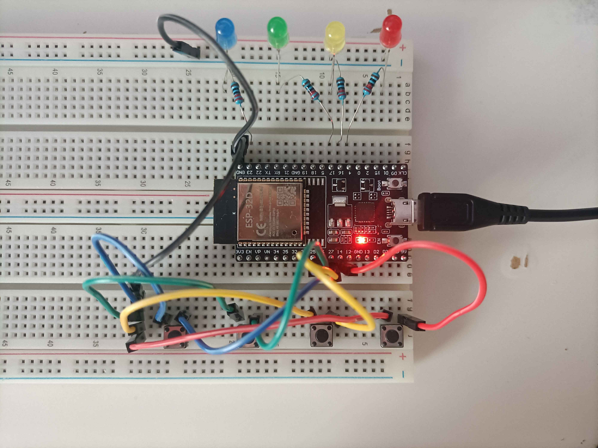

  <h1>Memory Game</h1>
  
Repeat after me game

  
  
  

## 📜 About The Project
A simple game for remembering sequences on <b>ESP32-DevKitC</b>.  
<h3>List of products:</h3>
<ul>
  <li>ESP32 DevKit C</li>
  <li>4x Diode LED'S | Red, Yellow, Green, Blue</li>
  <li>4x Buttons (tact switch)</li>
  <li>4x Resistor 220Ω</li>
</ul>

## ✨ Features
- 📈 Scalable code for more LEDs.

## 📸 Images

x

<!-- 
 -->
  <!--  -->
  <!--  -->
  <!--  -->
  <!--  -->
<!-- 
 -->

## 🔧 Breadboard Configuration
<table>
  <tr>
    <td style="padding-right: 30px;">
      
    </td>
    <td>
      <h3>ESP32 → Diode Led's</h3>
      <ul>
        <li>4 → Red</li>
        <li>16 → Yellow</li>
        <li>17 → Green</li>
        <li>23 → Blue</li>
      </ul>
      <h3>ESP32 → Buttons</h3>
      <ul>
        <li>14 → Red</li>
        <li>27 → Yellow</li>
        <li>26 → Green</li>
        <li>25 → Blue</li>
      </ul>
      
All buttons and leds are connected to GND

      
LED resistor 220Ω

    </td>
  </tr>
</table>

## 🛠️ Installation

x

## ✅ Run
Use <b>PlatformIO Serial Monitor</b> in VS Code + PlatformIO or other IDE

## 💡 How to use
To start the game, click any button.   
Click the buttons corresponding to the lights in the correct order.   
If you click the wrong button, click any button to start over.   
After winning, click any button to play again.   

## 📝 TODO
- [ ] add global variable for number of LEDs
- [ ] update photos
- [ ] update installation
- [ ] add LCD
- [ ] add LED