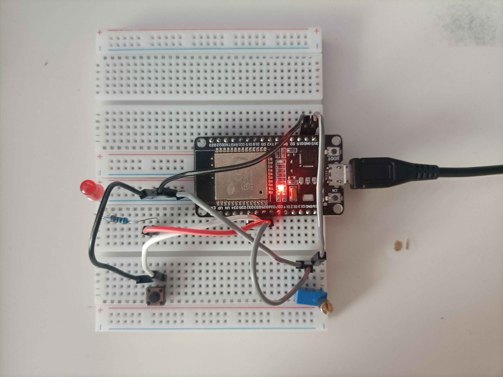

  <h1>Tattoo Power Supply (prototype)</h1>
  
Tattoo power supply prototype on diode led and potentiometer

  
  
  

## 📜 About The Project
TPS prototype on <b>ESP32-DevKit v1</b>.  
The diode led is "tattoo machine" and button is "footswitch".   
In this project, the potentiometer controls the PWM of the LED. In reality, the power supply transmits the volts to the tattoo machine.   
The footswitch (button) turns the tattoo machine on or off.
<h3>List of products:</h3>
<ul>
  <li>ESP32 DevKit v1</li>
  <li>Diode LED (red)</li>
  <li>Button (tact switch)</li>
  <li>Potentiometer</li>
  <li>Resistor 220Ω</li>
</ul>

## ✨ Features
- 🚨 You can change the brightness of the LED when it is off.

## 📸 Images

x

<!-- 
 -->
  <!--  -->
  <!--  -->
  <!--  -->
  <!--  -->
<!-- 
 -->

## 🔧 Breadboard Configuration
<table>
  <tr>
    <td style="padding-right: 30px;">
      
    </td>
    <td>
      <h3>ESP32 → Potentiometer</h3>
      <ul>
        <li>3V3 → ?</li>
        <li>32 → ?</li>
        <li>GND → ?</li>
      </ul>
      <h3>ESP32 → Other</h3>
      <ul>
        <li>26 → Diode LED</li>
        <li>25 → Button</li>
      </ul>
      
Button and LED connect to GND

      
LED resistor 220Ω

    </td>
  </tr>
</table>

## 🛠️ Installation

x

## ✅ Run
Use <b>PlatformIO Serial Monitor</b> in VS Code + PlatformIO or other IDE

## 💡 How to use
Control the brightness of the LED using the potentiometer.    
Turn on the LED using the button.

## 📝 TODO
- [ ] update photos
- [ ] update installation
- [ ] add LED