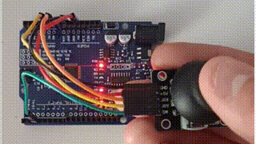
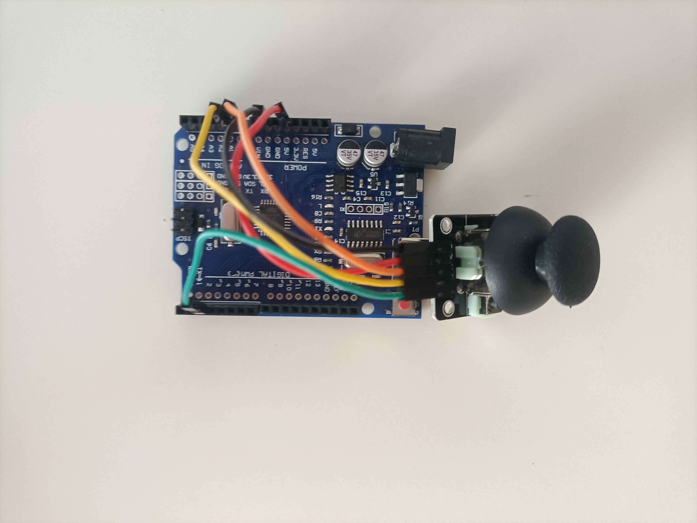

 

  <h1>Analog Joystick with Turtle</h1>
  
Controlling turtle in python using analog joystick

  
  
  
  

## 📜 About The Project
The combination of hardware and software allows you to control the turtle in real time using an analog joystick.
Created on <b><i>Fake</i> Arduino Uno</b>.
<h3>List of products:</h3>
<ul>
 <li><i>Fake</i> Arduino Uno</li>
 <li>Analog Joystick</li>
</ul>

## ✨ Features
- 🐢 Real-time drawing in turtle.

## 📸 Images

  
  

## 🔧 Configuration
<table>
  <tr>
    <td style="padding-right: 30px;">
      
    </td>
    <td>
      <h3>Arduino Uno → Joystick</h3>
      <ul>
        <li>GND → GND</li>
        <li>5V → +5V</li>
        <li>A0 → VRX</li>
        <li>A1 → VRY</li>
        <li>2 → SW</li>
      </ul>
    </td>
  </tr>
</table>

## 🛠️ Installation

x

## ✅ Run
Run <b>software/main.py</b>

## 💡 How to use
Move turtle using joystick.  
Click joystick for reset turtle.

## 📝 TODO
- [ ] update installation
- [ ] connect gifs in 1