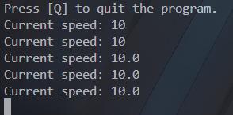
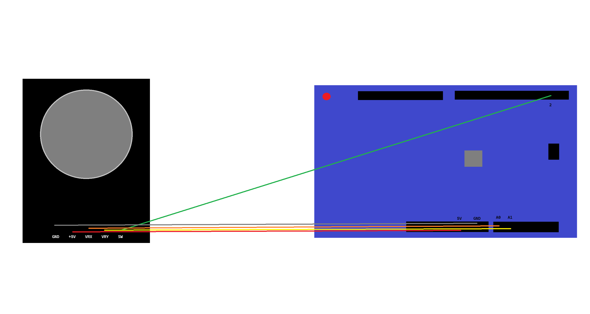

 <div id="start" align="center">
  <h1>Analog Joystick with Turtle</h1>
  <p>Controlling turtle in python using analog joystick</p>
  
  
  
  
</div>

## 📜 About The Project
The combination of hardware and software allows you to control the turtle in real time using an analog joystick.

## ✨ Features
- 🐢 Real-time drawing in turtle.

## 📸 Screenshots / GIFs / Photos
<div style="display: flex; flex-wrap: wrap; justify-content: center; gap: 10px;">
  
  
  
  
</div>

## 🔧 Connection Configuration

<h3>Joystick -> Arduino Uno</h3>
<ul>
  <li>GND -> GND</li>
  <li>+5V -> 5V</li>
  <li>VRX -> A0</li>
  <li>VRY -> A1</li>
  <li>SW -> 2</li>
</ul>

## 🛠️ Installation
<p>x</p>

## 👍 Run
```
Run software/main.py
```

## 📝 TODO
- [ ] update installation process